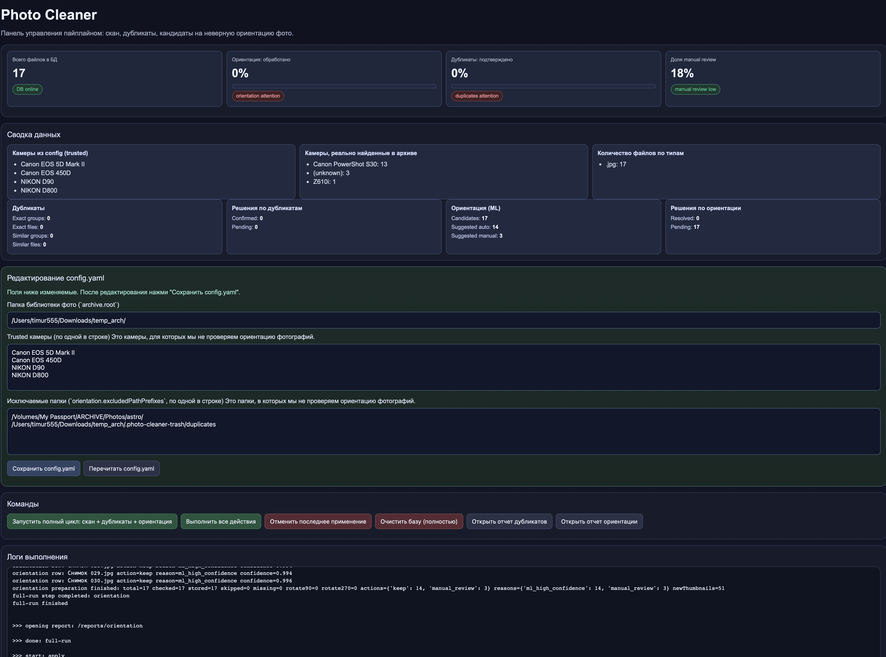

# Photo Cleaner

`Photo Cleaner` — локальная система для быстрой чистки фотоархива:  
сканирует архив, находит дубликаты, подсказывает проблемы с ориентацией, сохраняет все решения в SQLite и позволяет применить их в один клик через веб-панель.



## Что вы получаете

- Единый workflow: `полный цикл = скан + дубликаты + ориентация`.
- Динамические отчеты (без статических html-слепков): данные всегда берутся из БД.
- Автосохранение решений по каждому действию пользователя.
- Безопасное применение изменений с `dry-run` и `undo-last-apply`.
- Подготовка датасета и обучение модели ориентации на подтвержденных кейсах.

## Быстрый старт (5 минут)

### 1) Установка

```bash
python3 -m venv .venv
source .venv/bin/activate
python -m pip install -r requirements.txt
```

### 2) Настройка `config.yaml`

Минимально проверьте:
- `archive.root` — путь к архиву фото;
- `workspace.path` — рабочая папка (БД, отчеты, превью, модели);
- `orientation.trustedCameraModels` — камеры, которые считаются “правильными” по ориентации;
- `orientation.excludedPathPrefixes` — папки, которые нужно полностью игнорировать.

### 3) Запуск панели

```bash
python -m photo_cleaner --config config.yaml
```

Панель откроется на `http://127.0.0.1:8765`.

### 4) Запуск полного цикла

Нажмите кнопку:
- `Запустить полный цикл: скан + дубликаты + ориентация`

До первого полного цикла остальные действия в панели намеренно заблокированы.

### 5) Подтверждение и применение

1. Откройте отчеты:
   - `Открыть отчет дубликатов`
   - `Открыть отчет ориентации`
2. Подтвердите решения.
3. Вернитесь в панель и нажмите `Выполнить все действия`.

---

## Элементы админ-панели

### 1) `KPI и статус`

- **Всего файлов в БД** — текущее количество фото в `photos`.
- **Ориентация: обработано** — доля подтвержденных решений по ориентации.
- **Дубликаты: подтверждено** — доля подтвержденных групп дубликатов.
- **Доля manual review** — сколько кандидатов по ориентации осталось ручными.

### 2) `Сводка данных`

Карточки:
- **Камеры из config (trusted)** — камеры, исключенные из проверки ориентации.
- **Камеры, реально найденные в архиве** — фактическое распределение по камерам.
- **Количество файлов по типам** — распределение по расширениям.
- **Дубликаты** — количество exact/similar групп и файлов.
- **Решения по дубликатам** — `Confirmed / Pending`.
- **Ориентация (ML)** — `Candidates / Suggested auto / Suggested manual`.
- **Решения по ориентации** — `Resolved / Pending`.

### 3) `Редактирование config.yaml`

- Изменяемые поля:
  - `archive.root`
  - `orientation.trustedCameraModels`
  - `orientation.excludedPathPrefixes`
- Кнопки:
  - `Сохранить config.yaml`
  - `Перечитать config.yaml`

Важно: папка `duplicates.trashDir` автоматически добавляется в ignored-list ориентации.

### 4) `Команды`

- **Запустить полный цикл: скан + дубликаты + ориентация**  
  главный вход в систему.
- **Выполнить все действия**  
  применяет подтвержденные решения из БД к архиву.
- **Отменить последнее применение**  
  откатывает последний `apply` по журналу.
- **Очистить базу (полностью)**  
  удаляет `workspace/cleanup.db` и `workspace/actions.json`.
- **Открыть отчет дубликатов / ориентации**  
  быстрый переход в интерактивные отчеты.

### 5) `Логи выполнения`

Показывает живой лог текущей операции: этапы, прогресс, ошибки и финальный статус.

---

## Как работают отчеты

### Отчет дубликатов (`/reports/duplicates`)

- Показывает exact и similar группы.
- Позволяет выбрать KEEP/MOVE.
- Есть массовая кнопка “Согласиться со всеми рекомендациями”.
- Все изменения сразу сохраняются в БД (`duplicateActions`).

### Отчет ориентации (`/reports/orientation`)

- Показывает каждое фото-кандидат с вариантами поворота.
- Можно принять рекомендацию или выставить вручную (`90`, `270`, `manual`).
- Есть массовая кнопка “Согласиться со всеми рекомендациями”, при этом вручную измененные карточки не перетираются.
- Все изменения сразу сохраняются в БД (`orientationActions`).

---

## Настройка системы (ключевые блоки `config.yaml`)

- `archive.root` — корень фотоархива.
- `workspace.path` — рабочая папка сервиса.
- `files.jpegExtensions` / `files.rawExtensions` — поддерживаемые форматы.
- `duplicates.trashDir` — куда переносить MOVE-файлы.
- `orientation.trustedCameraModels` — камеры, исключенные из orientation-candidates.
- `orientation.excludedPathPrefixes` — подпапки, полностью исключенные из скана и последующей аналитики.
- `orientation.candidateExtensions` — расширения кандидатов ориентации.
- `orientation.neverRotateExtensions` — расширения, которые не вращаем.
- `orientation.ml.*` — параметры модели/инференса/обучения.

---

## Важно про скан и “игнор”

После каждого скана БД синхронизируется с актуальным результатом сканера:
- файлы из ignored-папок не попадают в `photos`;
- если раньше были в БД, после перескана удаляются;
- для дублей и ориентации они “как будто не существуют”.

---

## CLI-команды

Запуск панели:

```bash
python -m photo_cleaner --config config.yaml
```

Обучение:

```bash
python -m photo_cleaner train-orientation-model --config config.yaml
```

Применение/откат:

```bash
python -m photo_cleaner apply --config config.yaml --dry-run
python -m photo_cleaner apply --config config.yaml
python -m photo_cleaner undo-last-apply --config config.yaml --dry-run
python -m photo_cleaner undo-last-apply --config config.yaml
```

---

## Тесты

```bash
source .venv/bin/activate
python -m unittest discover -s tests -p "test_*.py" -v
```

---

## Типовые проблемы

- **Панель показывает старые данные**  
  Перезапустите сервер и сделайте hard refresh страницы.

- **Кандидатов по ориентации мало/много**  
  Проверьте `trustedCameraModels`, `excludedPathPrefixes`, `candidateExtensions`.

- **`apply` дает много skipped/errors**  
  Обычно неверный `archive.root` (БД и файловая система смотрят в разные пути).
